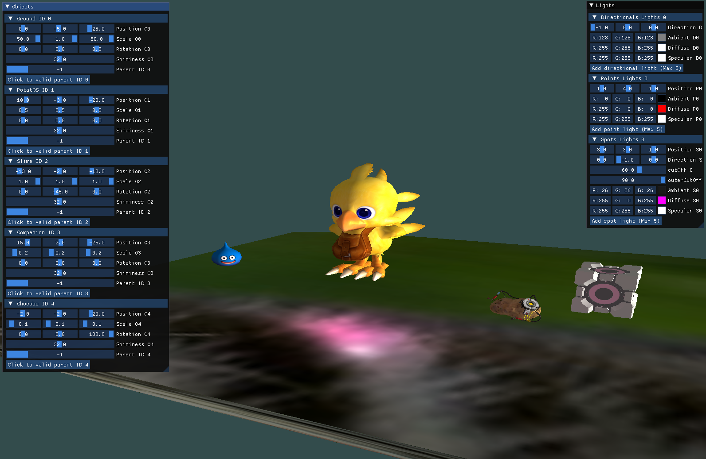

# Project Modern OpenGL
<hr />

**Authors : Omaya Lise**

For ISART Digital

<hr /><br />

## **Project description :**
Our goal was to create a basic graphic engine using OpenGL 3. This project allowed us to discover basic shaders innerworking as well as Modern OpemGL globally.


## To build and run the project : 
Open the project in Visual Studio and start this (F5).
<br /><hr />
## **Commands :**
- Right-click on the window : 
  - Direct the camera with the mouse
- W/S : Move forward/backward
- A/D : Move left/right
- Shift/Spacebar: Move up/down
- F1 : Show Wireframe
- F2 : Switch back to default visuals


- Objects and lights values can be modified on their own panels
- ATTENTION : The user needs to be mindful of which parents he choose for each child. 
If he creates a loop between severals parents and children it would make the program crash( TO BE DEBUGGED ) 
</ul><br />

##  **Hardest part of the project:**

Understand and build a coherent architecture. <br />
<br />

##  **Features to add:**
 
- Optimize OBJ loader for a quicker launch 
- Manage .obj with submeshes
- Add a skybox
- Get better texture visuals with normal and shadow mapping
<br />
<hr />

##  **Steps Recap**
**Maths**
- Vec2, Vec3, Vec4 (all tested)
- Matrix4 (all tested)

**Resource Manager**
- Allow to create and stock all classes inheriting from IResource such as Model, Texture or Shader
- The elements stocked in it can be called without reloading them
- The elements can be deleted as well

**Obj Loader**
- Allow to load .obj as long as they do not contain submesh
- Can stock data in vertex and index buffer
- Model class and functions added

**OpenGL**
- Vertex and fragment shaders linked
- Shaderprogram generated

**Camera**
- Allow to move Up/Down and Left/Right 
- Start a FPS view while right-click is pressed 
- Send view matrix and projection matrix to shaders 
- Mesh class and functions added

**Lights**
- Allow to create three types of lights (directional, point and spot)
- The mix of scene's lights is calculated for each pixel (Blinn-Phong algorithm) in shaders

**Texture**
- Can handle .jpeg and .png
- Textures are send to fragment shader to be mixed with lights

**SceneGraph**
- Allow to use parent/child system

**ImGUI**
-Allow modify values in real-time

<br />
<hr />

## **Architecture (exclude external libraries)**
```sh.
├── Headers
│   ├── imgui
│   ├── Assertion.hpp
│   ├── Camera.hpp
│   ├── Light.hpp
│   ├── Log.hpp
│   ├── Mesh.hpp
│   ├── Model.hpp
│   ├── myMath.hpp
│   ├── Object.hpp
│   ├── ResourceManager.hpp
│   ├── Shader.hpp
│   ├── Object.hpp
│   ├──Scene.hpp
│   ├── Texture.hpp
│   └── Transform.hpp
├── Sources
│   ├── imgui
│   ├── Assertion.cpp
│   ├── Camera.cpp
│   ├── Light.cpp
│   ├── Log.cpp
│   ├── Mesh.cpp
│   ├── Model.cpp
│   ├── myMath.cpp
│   ├── Object.cpp
│   ├── ResourceManager.cpp
│   ├── Shader.cpp
│   ├── Object.cpp
│   ├──Scene.cpp
│   ├── Texture.cpp
│   └── Transform.cpp
├── Resources
│   ├── Obj
│   ├── Shaders
│   └── Textures
└── README.md

``` 

Code editor : Visual Studio
<br />
System : Windows
